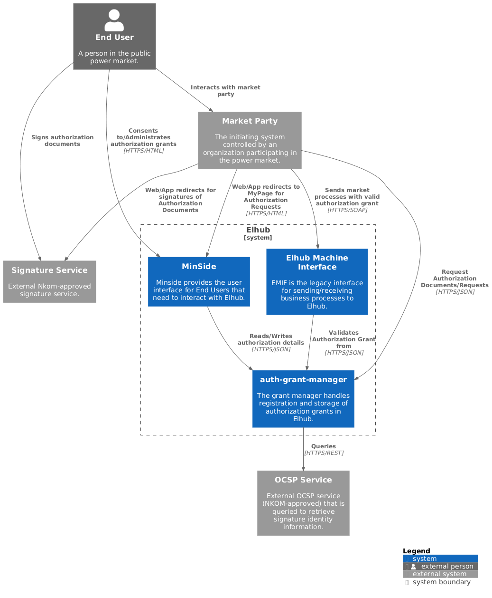
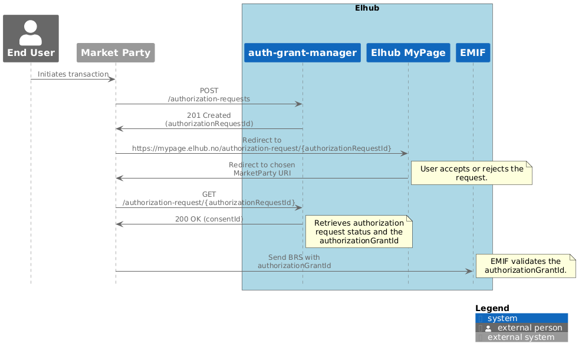

# Architecture

## Context

### Purpose

The auth-grant-manager is designed to manage authorization grants for various client applications. It does this by
permitting clients to perform authorization requests or provide signatures on authorization documents.

### Key Actors

- End Users
- Market Party Systems

### Interactions

The auth-grant-manager provides two key interaction flows: authorization requests and authorization document signing.
The system interacts with external authentication services to validate and process these requests.

**Authorization Requests:**

**Authorization Documents:**

## Containers

The auth-grant-manager is a service that consists of a REST API and a PostgreSQL database. It requires a number of
supporting internal services and external dependencies to function properly.

- **auth-grant-manager-api:** Built with Kotlin and Ktor. Exposes REST endpoints using the OpenAPI spec defined in
    `resources/openapi.yaml` for managing authorization requests, documents and grants.
- **auth-grant-manager-db:** PostgreSQL dbms is used for persistence, with schema changes managed by Liquibase.
    Interactions are performed via a persistence layer using Exposed.
- **Supporting Internal Services:**
  - **Policy Decision Point (PDP):** A separate service that handles authorization decisions.
  - **Persons:** A service that handles user identity and associated data.
- **External Dependencies:**
  - **OCSP:** An external service for validating the user identity on signatures.

> [!NOTE]
> Missing documentation of MaskinPorten and OIDC integrations.
