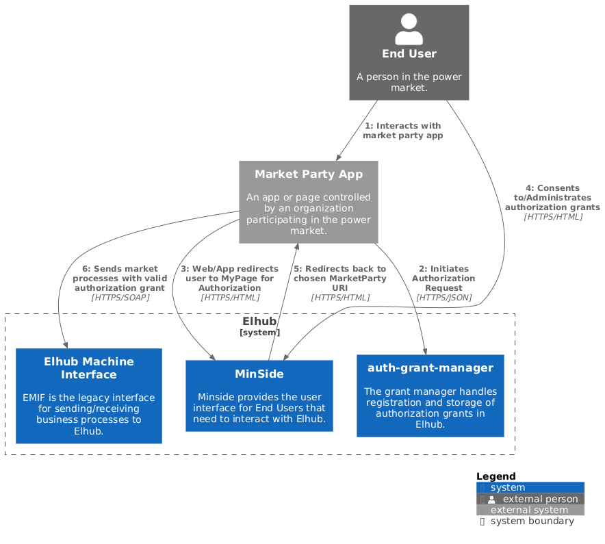
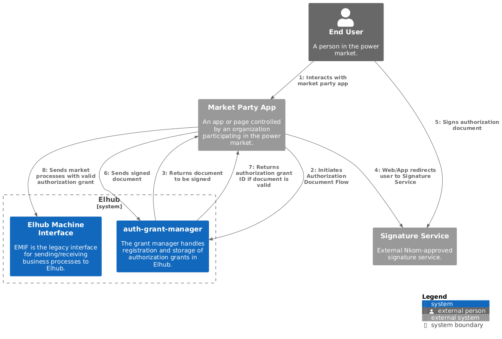
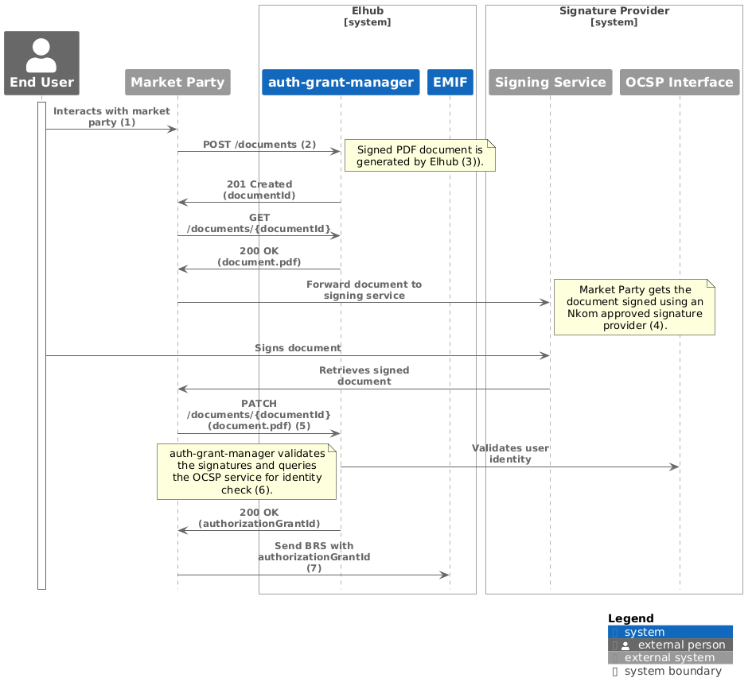

# User Guide

The Authorization Grant Manager handles the process for requesting and maintaining authorizations in the Elhub system.
between individuals and organizations. This service offers a REST API that is used when a client application needs to
request authorization/consent from a user to carry out an operation in Elhub on their behalf.

## Context

### Who is this for?

This API can be used by market actors who need to collect consent from end users for operations in Elhub. The physical
sender of the API request must be registered in the Elhub actor registry as a Maskinporten client.

All communication towards Elhub can be performed on-behalf of the Market Party, by a Service Provider. For simplicity,
we refer to the communicating party as the Market Party in this documentation.

This documentation is intended for developers and architects who are responsible for integrating with the Elhub system.

### Consent Flows

The Authorization Grant Manager API provides two primary interaction flows for retrieving consents:
AuthorizationRequest and AuthorizationDocument. Both flows can be used to request consent from end users.

The AuthorizationRequest flow is used to initiate and manage a request for authorization/consent through the Elhub
MyPage. This flow has the user being redirected to the Authorization approval page in Elhub MyPage (requiring a login
through IDPorten) where the user can approve or deny the request. Upon doing so, the user is redirected back to the
client application.



THe AuthorizationDocument flow is used to request consent from end users without the need for a redirect to Elhub.
This flow has the market party application send a request to the Authorization Grant Manager API, which
then generates a document that can be sent to the end user for signing. The end user must sign the document and
the signed document must be sent back to the Authorization Grant Manager API. The API will then process the signed
document and update the authorization status accordingly.



### Specifications

The API is defined using the OpenAPI 3.x specification. The OpenAPI specification is available in this repository as
[src/main/resources/openapi.yaml](https://github.com/elhub/auth-grant-manager/blob/main/src/main/resources/openapi.yaml).

The OpenAPI specification provides a machine-readable description of the API, including endpoints, request/response
formats, authentication methods, and other relevant details. You can use this specification with any OpenAPI-compatible
tools to generate client libraries, server stubs, and view the API documentation using tools like Swagger UI.

Request and response payloads are defined using JSON Schema. The JSON Schemas are available in this repository in
[src/main/resources/schemas](https://github.com/elhub/auth-grant-manager/tree/main/src/main/resources/schemas).

> [!WARNING]
> The OpenAPI specification and JSON Schemas are still under development and **are not** complete. While we do not
> intend to make breaking changes to APIs already implemented, we may add new endpoints and modify existing ones as we
> iterate on the API design (also based on your feedback).
>
> Please check the repository regularly for updates.

## Authorization Request Flow

> [!NOTE]
> The flow is largely implemented in the API already, but MyPage does not yet have the required pages implemented.
> Documentation is WIP.

## Authorization Document Flow

### Background

The Authorization Document flow is provided as an alternative to the Authorization Request flow so that the Market
Party can collect consent from end users without the need for a redirect to the Elhub MyPage. The solution will
provide a digitally signed document for Elhub to verify that the user has consented to the operation as described
by the document.

The process integrates a trusted third-party identity verification service national eID provider—to confirm the
signer's identity before the signature is applied. This ensures that only the intended individual can sign the
document, providing Elhub with a tamper-proof, verified, and compliant digital record. The result is a signed
PDF document that meets legal and regulatory standards.

### Authenticating via Maskinporten

* The Market Party MUST be registered in Maskinporten with assigned scoped for access to Elhub.
  * See [Elhub API Portal](https://api.elhub.no/maskinporten/getting-started)
* The Market Party MUST use a Maskinporten approved business certificate ("virksomhetssertifikat") for
  identification with Maskinporten.
* All API requests to Elhub MUST include the Maskinporten access token in the Authorization header:
    ```
    Authorization: Bearer {token}
    ```

### Acting On Behalf Of Another Party

* If a Service Provider performs the operation on behalf of another party, the party the operation is performed
    on behalf of MUST be identified using the party’s GLN. The GLN is attached to the call to the Elhub API in the
    Authorization header:
    ```
    On-Behalf-Of: {GLN}
    ```
* The Service Provider MUST be registered in Ediel as a Service Provider for the Market Party.

### Authorization Document Signing Requirements

* The Market Party MUST use a trusted document signing service for the end user to sign the document.
  * The signing service MUST be on the [Nkom's Trusted list](https://www.nkom.no/tjenester/tillitsliste)
* The signing process MUST meet:
  * **High level of assurance**: Security Level 4 (sikkerhetsnivå 4)
  * **Signature Standard**: PAdES B-B
  * **Identity validation**: The signing service must provide the OCSP extension: `2.16.578.1.16.3.2`
        (Norwegian national identity number – fødselsnummer). This is required in order for Elhub to
        verify the identity of the end user.

### Technical Flow



1. **Initiation**<br>
    * The End User initiates a process with the Market Party
2. **Request document**<br>
    * The Market Party requests initiation of an authorization document flow with the .
3. **Document Generation by Elhub**<br>
    * Elhub generates a consent document (PDF) and returns a document ID.
        * The document includes metadata specifying who must sign.
        * Elhub signs the document with its own business certificate, using the **PAdES B-B** standard.
4. **Signature Collection**<br>
    * The Market Party retrieves the document using the document ID.
        * The document is forwarded to a **Nkom-approved signing service**.
        * The End User signs the document using their individual certificate.
        * The signature uses the **PAdES B-B** standard.
5. **Return to Elhub**<br>
    * The Market Party submits the signed document to Elhub using the original document ID.
6. **Verification by Elhub**<br>
    * Elhub verifies:
        * The document content
        * The digital signatures
        * The End User’s identity using OCSP lookup with the signing service
    * Upon successful validation, Elhub registers the authorization grant for the defined valid period.
    * The authorization document is stored in Elhub for future reference.
7. **Execute Market Process**<br>
    * The Market Party can now execute the market process using the authorization granted by the end user.
